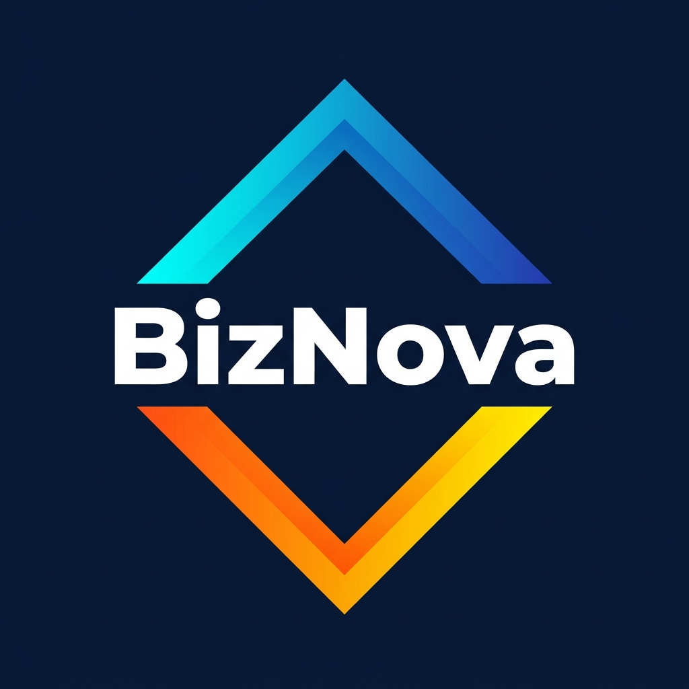

<div align="center">
  
  <h1>BizNova AI-Powered Business Intelligence Platform</h1>
  <p><strong>From Idea to Execution with AI BizNova</strong></p>
  
  <p>
    
    
    
    
  </p>
</div>

---

## 🌟 Overview

**BizNova** is an end-to-end Machine Learning and Generative AI-powered SaaS dashboard designed to help entrepreneurs discover, evaluate, and execute profitable business ideas. Using automated workflows, real-time data, and predictive models, BizNova transforms raw business concepts into actionable business intelligence.

Whether you're brainstorming your first startup or analyzing complex market trends, BizNova provides the strategic edge required to succeed in a modern, dynamic market.

## ✨ Core Features

- ** AI Idea Generation:** Get strictly personalized business ideas tailored to your budget, technical skills, and geographical location using advanced Generative AI capabilities.
- ** Market Analysis Pipeline:** Deep dive into product demand, competitive landscape, and city-wise insights powered by reliable background machine learning models.
- ** Future Forecasting:** Anticipate market movements using real-time time-series predictive modeling visualized with robust data charts.
- ** Automated Business Plans:** Instantly generate complete business plans encompassing tactical execution strategies, marketing layouts, and investment breakdowns.
- ** Context-Aware AI Assistant:** A persistent AI copilot seamlessly integrated into the application to offer continuous guidance and data-driven decision reinforcement.
- ** Secure Authentication Flow:** Professional split-screen UI for local or SSO (Google/Apple) seamless user onboarding and session management.

## 🛠️ Technology Stack

### Frontend Architecture
- **Framework:** React.js powered by Vite for blazing-fast Hot Module Replacement (HMR).
- **Styling:** Vanilla Tailwind CSS configured for a premium, custom Glassmorphism/Cyberpunk dark theme (`dark`, `brand`, and `accent` tailored tokens).
- **Icons & Graphics:** Lucide React for consistent vector iconography.
- **Routing:** React Router DOM (v6 layout-based routing).
- **Data Visualization:** Recharts for rendering rich KPIs and analytical forecasts.

### Backend & AI Architecture (FastAPI + MLOps)
- **API Framework:** Python 3 + FastAPI for highly performant, asynchronous API resolution.
- **Architecture Type:** Modular, Domain-Driven Design (Core, API Routes, DB, Schemas, AI services).
- **AI Integration:** RAG (Retrieval-Augmented Generation) pipelines, custom LLM clients.
- **Database Model:** Standardized ORM interfaces (equipped for PostgreSQL / SQLAlchemy setup).

---

## 📁 Repository Structure

```text
biznova-ai-platform/
│
├── frontend/                 # React UI Application
│   ├── public/               # Static assets & logos
│   ├── src/
│   │   ├── components/       # Reusable components (Skeletons, Chat Bubbles, etc.)
│   │   ├── context/          # Global AppContext (Theme, Auth state, Sidebar)
│   │   ├── layouts/          # Layout wrappers (DashboardLayout)
│   │   ├── pages/            # Core views (Landing, Auth, Ideas, Analysis, etc.)
│   │   ├── index.css         # Tailwind directives & core application styling
│   │   └── App.jsx           # Main React Router configuration
│   └── package.json          # Node dependencies and execution scripts
│
└── backend/                  # FastAPI Application Core
    ├── app/
    │   ├── ai/               # Prompts, tools, LLM clients, and RAG pipelines
    │   ├── api/routes/       # Modular controllers (ideas.py, analysis.py, etc.)
    │   ├── core/             # Central configs and security modules
    │   ├── db/               # Repositories, models, and migrations
    │   ├── schemas/          # Pydantic models for Data Validation
    │   └── services/         # Decoupled business and auth logic
    ├── tests/                # Application unit/integration suites
    ├── requirements.txt      # Python deployment dependencies
    └── main.py               # Uvicorn/FastAPI initialization
```

---

## 🚀 Getting Started

### Prerequisites

- Node.js (v18+)
- Python (3.10+)

### Running the Frontend

1. Navigate to the `frontend` directory:
   ```bash
   cd frontend
   ```
2. Install standard dependencies:
   ```bash
   npm install
   ```
3. Run the Vite development server:
   ```bash
   npm run dev
   ```
   > The application will typically spin up at `http://localhost:5173`. 

### Running the Backend

1. Navigate to the `backend` directory:
   ```bash
   cd backend
   ```
2. Set up a virtual environment and install requirements *(recommended)*:
   ```bash
   python -m venv venv
   source venv/bin/activate  # On Windows: venv\Scripts\activate
   pip install -r requirements.txt
   ```
3. Boot up the FastAPI deployment server:
   ```bash
   uvicorn app.main:app --reload
   ```

---

## 👨‍💻 About the Creator

**Mudassar Hussain**  
*Data Scientist | AI/ML Engineer | Deep learning | MLOps | NLP | Gen AI & AI Agent*

Passionate about building scalable AI-driven solutions that solve real-world problems. With specialized expertise in Machine Learning, Generative AI, RAG architectures, and rigorous MLOps practices, BizNova was architected to empower entrepreneurs by turning abstract ideas into data-driven business intelligence.

- **GitHub:** [@MudassarGill](https://github.com/MudassarGill)
- **LinkedIn:** [M. Mudassar Hussain](https://linkedin.com/in/m-mudassar-85)
- **Email:** mudassarjutt65030@gmail.com
- **Portfolio:** [Mudassar Hussain](https://mudassar-ai-portfolio.onrender.com)

---

<p align="center">
  <i>© 2026 BizNova. AI-Powered Business Intelligence Platform. All rights reserved.</i>
</p>
